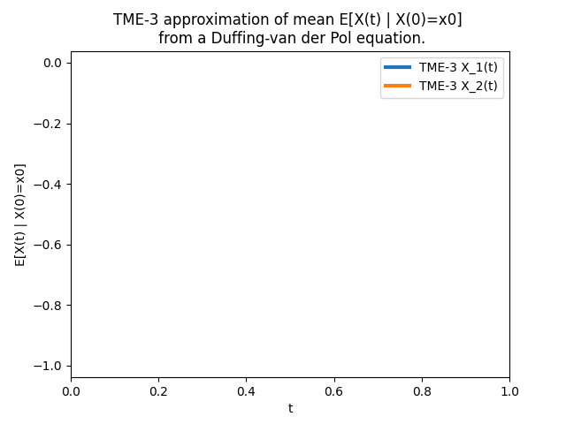
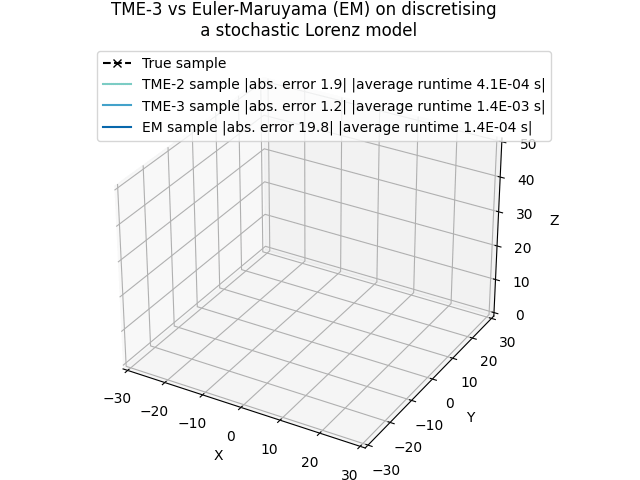

# Taylor moment expansion (TME) in Python and Matlab

[](https://github.com/zgbkdlm/tme/actions/workflows/unittest_py.yml)
[](https://tme.readthedocs.io/en/latest/?badge=latest)

This repository presents Python (SymPy and JaX) and Matlab implementations of TME. 

TME is an analytical method for estimating statistical quantities (e.g., mean, covariance, moments, or any non-linear expectation) of solutions of stochastic differential equations. In particular, if we use the TME method to approximate mean and covariance, we can then use the method to discretise solutions of SDEs.




Please find the documentation of this software at https://tme.readthedocs.io.

# Python example

Install via `pip install tme` or `python setup.py install` (Please note that if you would like to use JaX, please 
install `jax` by yourself beforehand).

```python
import tme.base_jax as tme
import jax.numpy as jnp
from jax import jit

# Define SDE coefficients.
alp = 1.
def drift(x):
    return jnp.array([x[1],
                      x[0] * (alp - x[0] ** 2) - x[1]])


def dispersion(x):
    return jnp.array([0, x[0]])


# Jit the 3-order TME mean and cov approximation functions
@jit
def tme_m_cov(x, dt):
    return tme.mean_and_cov(x=x, dt=dt,
                            a=drift, b=dispersion, Qw=jnp.eye(1),
                            order=3)

# Compute E[X(t) | X(0)=x0]
x0 = jnp.array([0., -1])
t = 1.

m_t, cov_t = tme_m_cov(x0, t)
```

More examples can be found in `./python/examples`

# Matlab example

See, folder `./matlab`. 

# How to cite?

Please cite the following paper/thesis.

Note that the thesis is not published yet (will be published around the end the 2021).

```
@phdthesis{ZhaoZheng2021,
	title = {State-space deep Gaussian processes},
	author = {Zheng Zhao},
	school = {Aalto University},
	year = {2021},
}
```

```
@article{ZhaozTME2019,
	title = {{T}aylor Moments Expansion for Continuous-Discrete {G}aussian Filtering},
	journal = {IEEE Transactions on Automatic Control},
	author = {Zheng Zhao and Toni Karvonen and Roland Hostettler and and Simo S\"{a}rkk\"{a}},
	volume = {66},
	number = {9},
	pages = {4460--4467},
	year = {2021}
}
```

# License

The GNU General Public License v3 or later

# Contributors

Zheng Zhao, Aalto University

Adrien Corenflos, Aalto University

See, `contributors.md` for detailed contributions from them.

You are very welcome to contribute!
