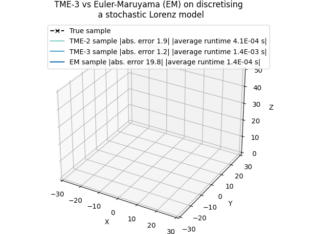
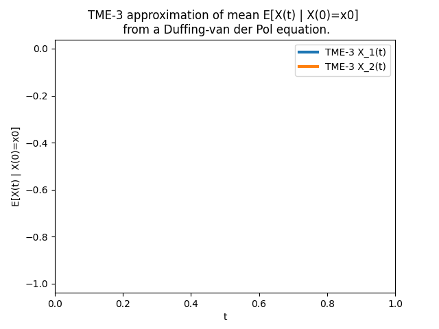

Taylor moment expansion in Python and Matlab
============================================

.. toctree::
   :maxdepth: 2
   :caption: Contents:

   install
   tme
   examples
   what_is_tme
   readings

Taylor moment expansion (TME) is a method for approximating propogations (in expectations) of stochastic differential equations (SDEs) solutions through (non-linear) functions. More formally, consider :math:`X(t)` be the solution of an SDE, then the TME method is able to approximate :math:`\mathbb{E}[\phi(X(t)) \mid X(s)]` for any target function :math:`\phi` of interest and times :math:`t<s`. This method is originally due to Dacunha-Castelle and Florens-Zmirou (1986) and Florens-Zmirou (1989). A more modern interpretation of the method is found in Zhao (2021).

This site consists of the documentation of the implementations of TME in Python and Matlab, (while we focus on Python a bit more). In addition, the Matlab implementation features a few examples of TME-based Gaussian filters and smoothers.

The source codes are availabe at the git repository `<https://github.com/zgbkdlm/tme>`_.

To begin, you can start with the examples in :doc:`examples`.

JaX vs SymPy
------------
For some reasons we implemented TME in both SymPy and JaX. However, we would suggest to 
use JaX as much as you can, due to two reasons: 1) the JaX implementaion is usually more efficient. 
2) the simplication method `sympy.simplify()` in SymPy can be very slow and sometimes throws weird errors.

However, the SymPy codes are written in an exactly-as-per-equation fashion, so the SymPy 
version can be a good reference implementaion.

License
-------
GPL v3 or later.

Indices and tables
==================

* :ref:`genindex`
* :ref:`modindex`
* :ref:`search`
