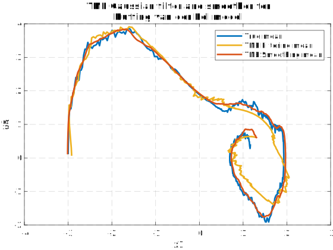

# Taylor Moment Expansion (TME) Gaussian Filter and Smoother in Matlab

TME implemented in Matlab.

## An example model
Considering a non-linear continuous-discrete state-space model (Duffing--van der Pol)

with initial value `x_0 = [-3, 0]`. 

Parameters values in simulation:

`alp = 2`: Value of α \alpha. 

`T = 5`:   Value of time length of the simulaton

`dt = 0.01`: Time interval (Higher order TME can adpat with longer dt)

We simply consider a linear measurement model because TME is only concerned with the non-linearity in continuous model. For some examples on non-linear measurement models, you can check our paper.

## How to Run
Simply open and run `example_duffing.m`. There are three functions `TME_GHKF.m` (Gauss-Hermite), `TME_CKF.m` (spherical cubature), and `TME_UKF` (unscented transform) available for TME with different sigma point methods.

## License

The GNU General Public License v3 or later
